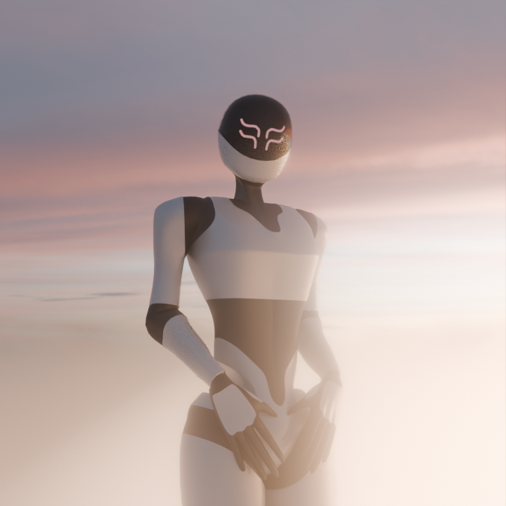
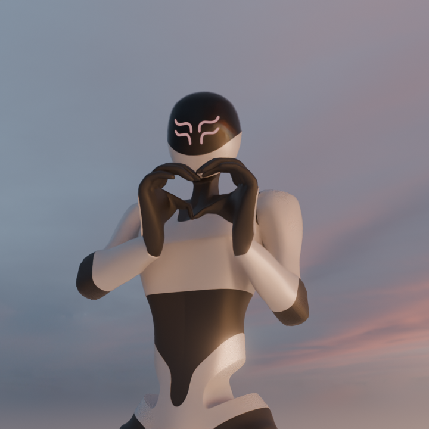

# ANDROID ROBOT — 3D MODEL

## Overview

A hard-surface Android-inspired robot designed and modeled from scratch in Blender, combining Pinterest references with my own design ideas.

## Workflow

* **Concept & Design:** Developed the design from references and my own ideas.
* **Modeling:** Built the robot from scratch using hard-surface techniques.
* **Texturing:** Used normal and bump maps for surface detail.
* **Rigging:** Created a custom rig and manually weight-painted the model.

## Renders & Media

**Full Project:** [https://drive.google.com/drive/folders/1lSgUhZPGHgEn2R5ZQvYJ-lxasyArEEU0?usp=sharing]
* **(this goggle drive got .blend/screenshots of the prosec)**

## Project Info

* **Software:** Blender
* **Type:** 3D Character
* **Focus:** Modeling, Texturing & Rigging
* **Time Spent:** XX hours
* **Status:** Completed

