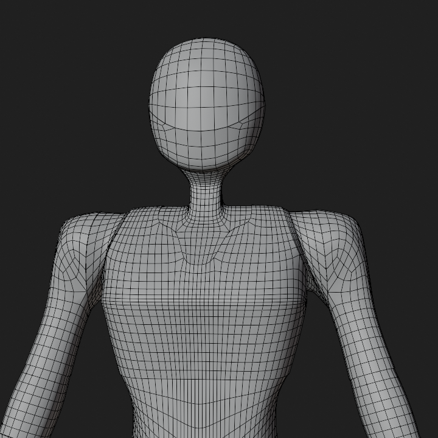
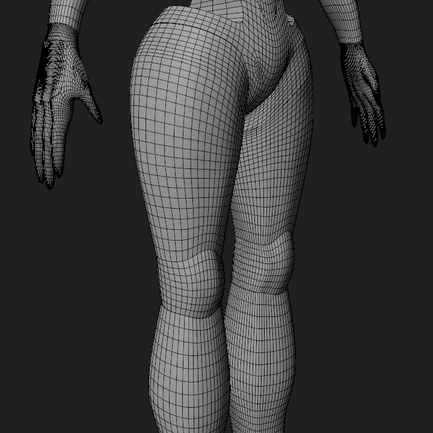

* # ANDROID ROBOT — 3D MODEL

## Overview

<table>
  <tr>
    <td></td>
    <td></td>
  </tr>
</table>

A hard-surface Android-inspired robot designed and modeled from scratch in Blender, combining Pinterest references with my own design ideas.

## Workflow

<table>
  <tr>
    <td></td>
    <td></td>
  </tr>
</table>

* **Concept & Design:** Developed the design from references and my own ideas.
* **Modeling:** Built the robot from scratch using hard-surface techniques.
* **Texturing:** Used normal and bump maps for surface detail.
* **Rigging:** Created a custom rig and manually weight-painted the model.

## Demo

**3D Model:** [View the 3D MODEL on Sketchfab](https://sketchfab.com/3d-models/robot-2befd254d70046ec89fe90bb3b164431)

## License

Licensed under **CC BY-NC 4.0**.
You may use, modify, and share this project for **non-commercial purposes**, with credit to **Binupa**.

**Commercial use or resale requires permission.**

[View the full CC BY-NC 4.0 license](https://creativecommons.org/licenses/by-nc/4.0/)

## Project Info

* **Software:** Blender
* **Type:** 3D Character
* **Focus:** Modeling, Texturing & Rigging
* **Time Spent:** 15-16 hours
* **Status:** Completed

